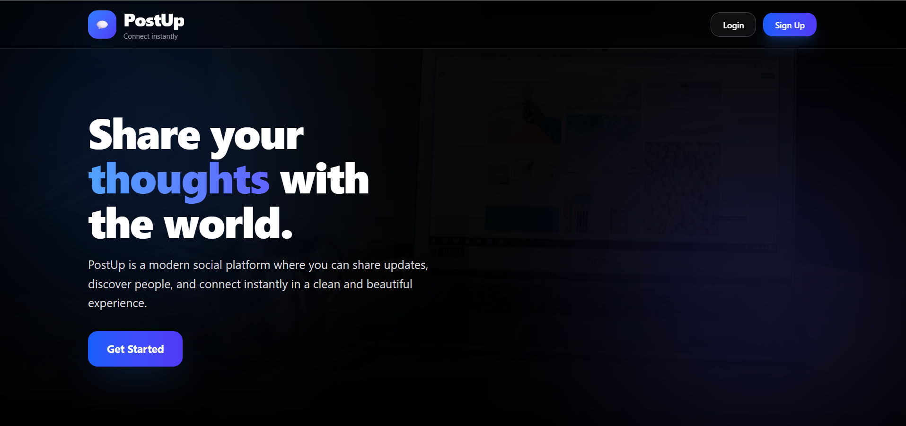
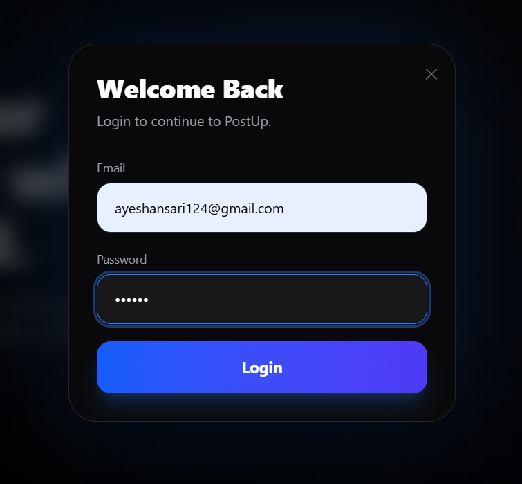
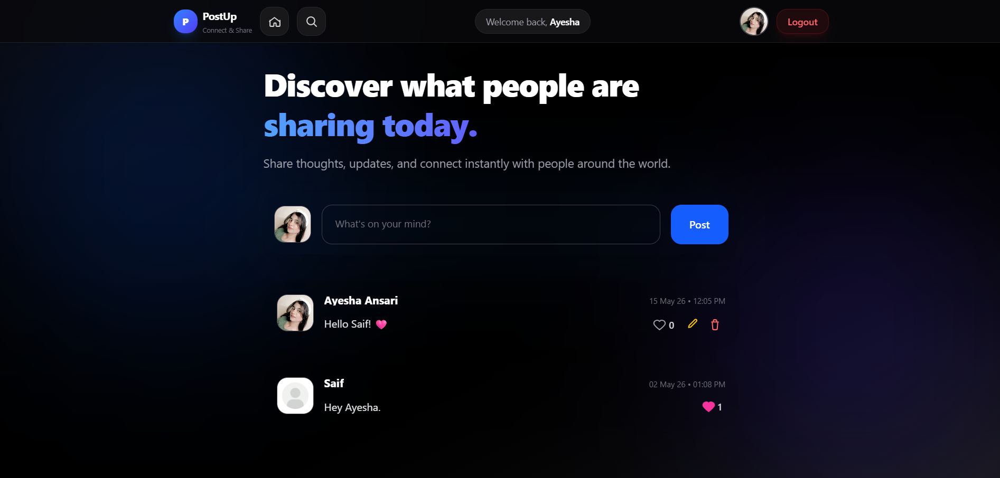
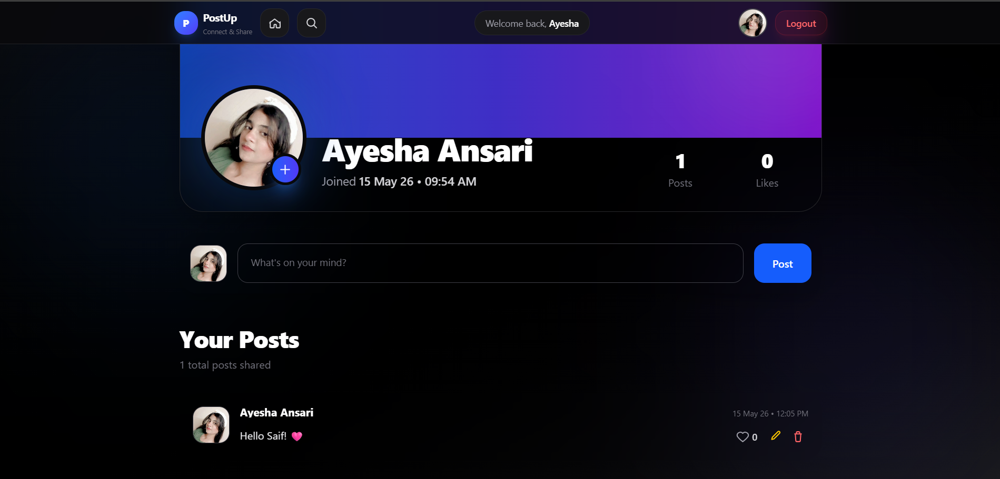
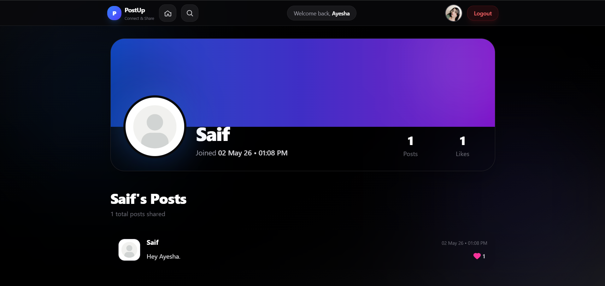
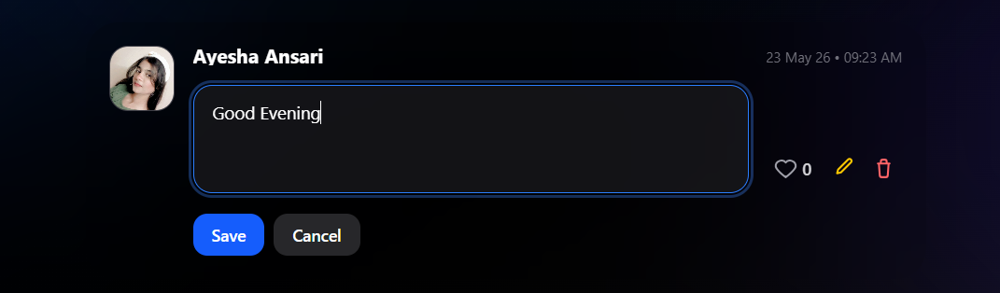
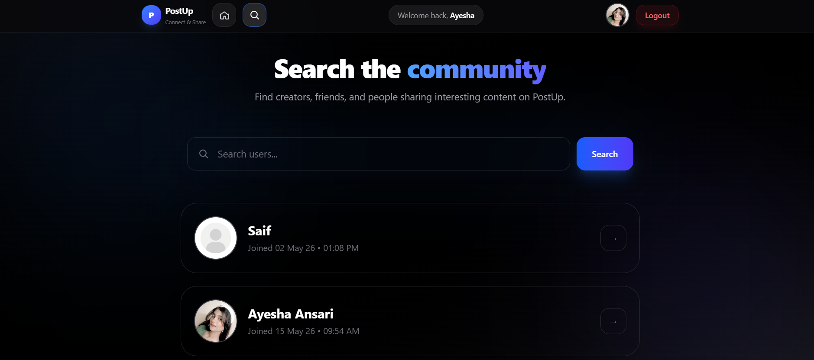

# 🌐 PostUp - Social Posting Platform

PostUp is a full-stack social media platform where users can create posts, interact with content, manage profiles, and explore other users.

## 🌐 Live Demo

https://post-up-xi.vercel.app/

---

## Features

- User signup, login, and logout
- Create, edit, and delete posts
- Like posts
- Personalized user profiles
- Upload profile images
- Public profile viewing
- Search users
- Latest posts feed
- Joined date and profile stats
- Human-readable timestamps using Day.js
- Responsive design across devices

---

## Tech Stack

- Node.js
- Express.js
- MongoDB
- Mongoose
- EJS
- JWT Authentication
- bcrypt
- Multer
- Cloudinary
- Day.js
- JavaScript

---

## 📸 Screenshots

### 🏠 Landing Page

---

### 🔐 Authentication

---

### 📰 Community Feed

---

### 👤 Personal Profile

---

### 🌍 Public User Profiles

---

### ✏️ Post Management

---

### 🔍 User Search

---

## 🧠 What I Learned

- JWT authentication workflows
- Protected routes and permissions
- CRUD operations with MongoDB
- File uploads using Multer
- Cloudinary image handling
- MVC backend architecture
- Dynamic EJS rendering
- User interaction workflows
- Responsive full-stack development

---

## 💡 Future Improvements

- Comment system
- Follow/unfollow users
- Real-time notifications
- Direct messaging
- Saved posts
- Infinite scrolling
- Dark mode

---

## 👩‍💻 Author

**Ayesha Ansari**

Built with ❤️ using Node.js, Express.js, MongoDB, and EJS